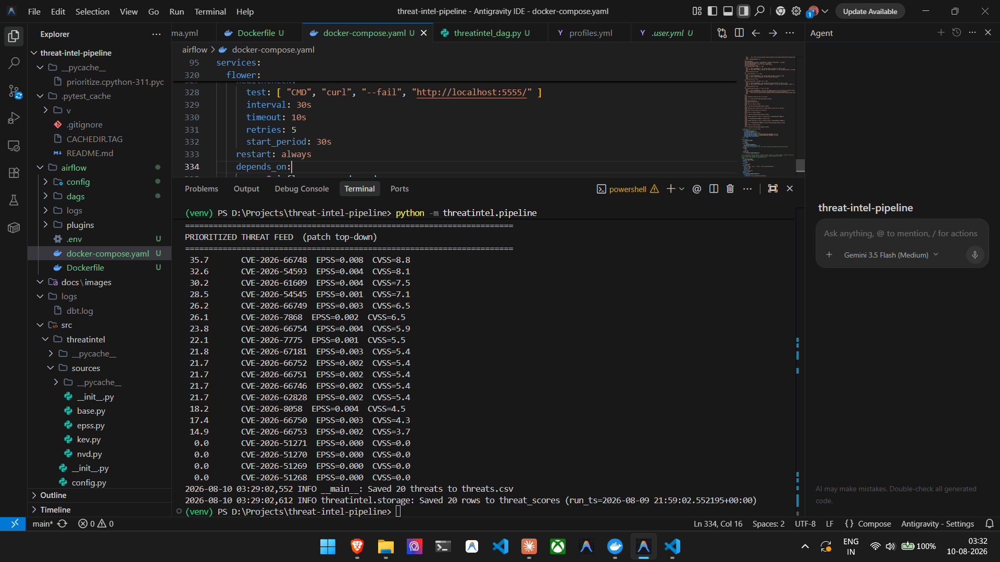
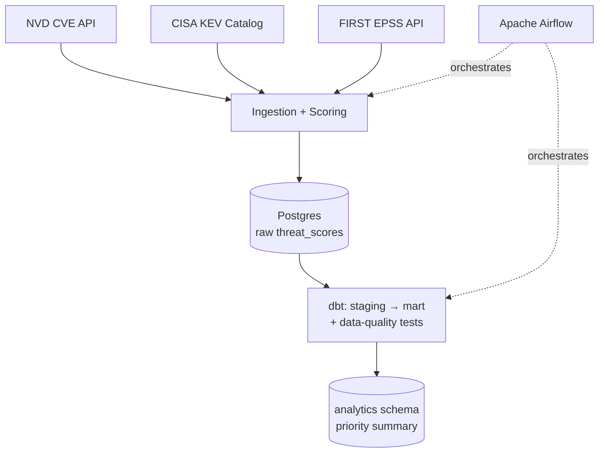
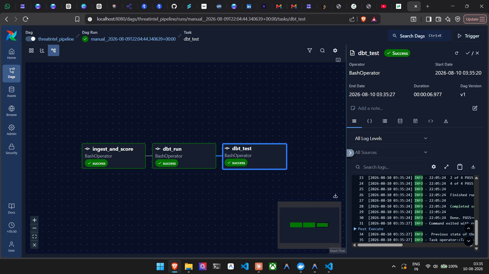
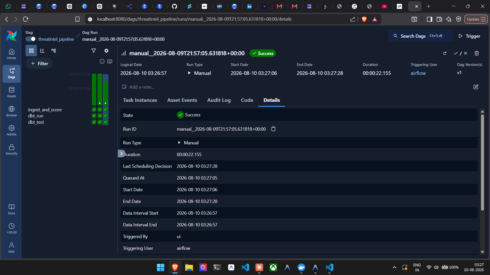
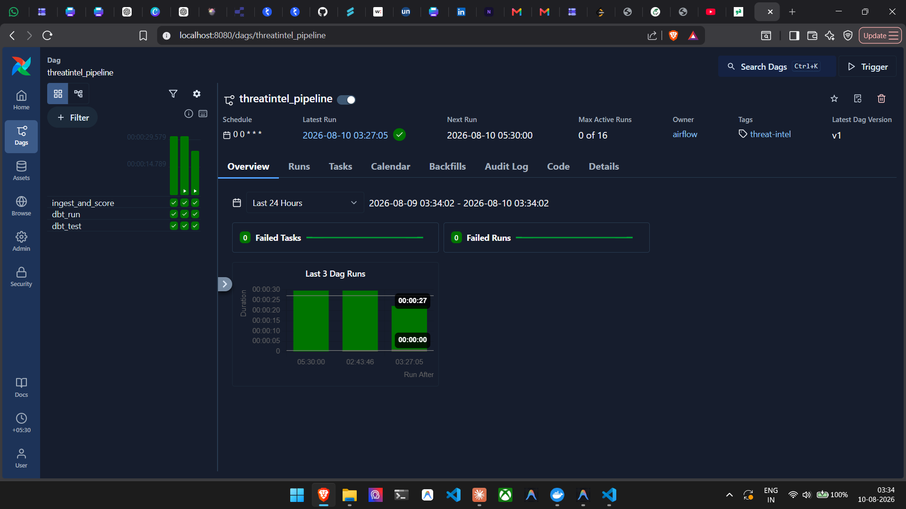

# Threat Intelligence Pipeline

> Vulnerability prioritization for defense-sector patch management — because CVSS severity alone doesn't tell you what to patch first.

[](./LICENSE)
[](https://www.python.org/)
[](https://www.getdbt.com/)
[](https://airflow.apache.org/)

An end-to-end data pipeline that ingests CVE data, scores each vulnerability by real-world exploitation risk, models the results with dbt, and orchestrates the whole flow on a schedule with Apache Airflow — all containerized with Docker.

---

## The problem

Most vulnerabilities are never exploited. Ranking purely by CVSS floods security teams with high-severity CVEs that pose little real-world risk, while genuinely dangerous ones get buried. This pipeline sharpens the signal by combining three sources:

- **CISA KEV** — is this CVE *known to be actively exploited* right now?
- **FIRST EPSS** — what's the *probability* it'll be exploited in the next 30 days?
- **CVSS** — how severe is it *if* exploited?

## Scoring model

| Condition | Priority |
|---|---|
| On the CISA KEV list | **100** (actively exploited — patch immediately) |
| Otherwise | `(EPSS × 0.6 + CVSS_normalized × 0.4) × 100` |

EPSS is weighted higher than CVSS because exploitation *probability* is a sharper urgency signal than static severity. Exploited CVEs are a tiny fraction of the total, which makes KEV + EPSS a far more selective "patch first" filter than severity alone.

## Prioritized output

The pipeline produces a ranked, patch-top-down feed:



## Architecture



**Layers:**

- **Ingestion** (`src/threatintel/`) — typed config via Pydantic `BaseSettings`, source clients for NVD / KEV / EPSS, weighted scoring, and a Postgres storage layer. Packaged with a src-layout `pyproject.toml`.
- **Transformation** (`threatintel_dbt/`) — a `sources → staging → mart` dbt layering. The mart rolls per-CVE scores into a per-run priority summary (counts by severity band, KEV count, averages). `not_null` and `unique` data-quality tests guard the models.
- **Orchestration** (`airflow/`) — a daily Airflow DAG runs three ordered tasks: ingest → `dbt run` → `dbt test`, containerized with Docker.

## Orchestration in action

The DAG runs the full flow as three dependency-ordered tasks:



A successful end-to-end run:



Run history showing consistent successful executions:



## Tech stack

| Layer | Tools |
|---|---|
| Language | Python 3.11 |
| Config & validation | Pydantic (BaseSettings) |
| Testing | pytest |
| Storage | PostgreSQL 16 |
| Transformation | dbt (dbt-postgres) |
| Orchestration | Apache Airflow 3 |
| Containerization | Docker / Docker Compose |
| Data sources | NVD CVE API 2.0, CISA KEV, FIRST EPSS |

## Getting started

### Prerequisites

- Python 3.11+
- Docker Desktop

### 1. Run the pipeline standalone

```bash
pip install -r requirements.txt
python -m threatintel.pipeline
```

Scores the latest CVEs, writes a ranked CSV, and (if Postgres is up) persists to the database.

### 2. Start Postgres

```bash
docker run --name ti-postgres \
  -e POSTGRES_PASSWORD=threatintel \
  -e POSTGRES_DB=threatintel \
  -p 5432:5432 -d postgres:16
```

### 3. Run the dbt models

```bash
cd threatintel_dbt
cp profiles.yml.example profiles.yml   # then fill in your DB password
dbt run
dbt test
```

### 4. Orchestrate with Airflow

```bash
cd airflow
docker compose up airflow-init   # one-time metadata DB setup
docker compose up -d
```

Open the UI at **http://localhost:8080** (default login `airflow` / `airflow`), unpause `threatintel_pipeline`, and trigger it.

## Project structure

threat-intel-pipeline/
├── src/threatintel/ # ingestion, scoring, storage
├── threatintel_dbt/ # dbt project (staging → mart, tests)
├── airflow/ # DAG, Dockerfile, docker-compose
├── tests/ # pytest suite
├── docs/images/ # README assets
└── README.md


## Data sources

- [NVD CVE API 2.0](https://nvd.nist.gov/developers/vulnerabilities)
- [CISA Known Exploited Vulnerabilities Catalog](https://www.cisa.gov/known-exploited-vulnerabilities-catalog)
- [FIRST EPSS API](https://www.first.org/epss/api)

## License

Released under the [MIT License](./LICENSE). © 2026 Neel Das.